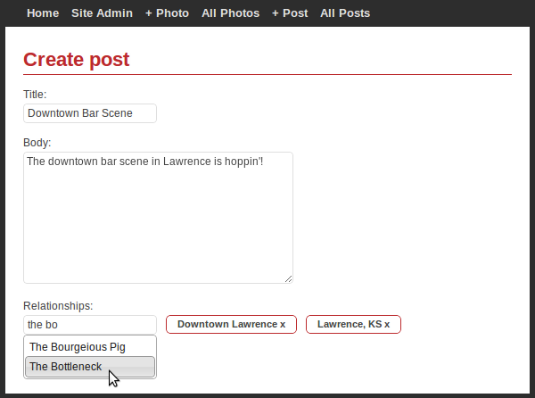
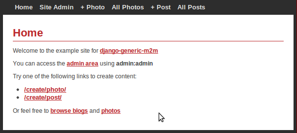
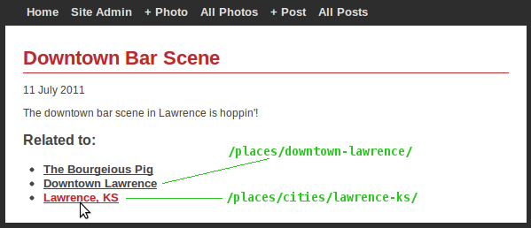

Example App
===========

The example app demonstrates how you can use django-generic-m2m to create "tags"
between different types of models.

It uses several apps from `django basic apps <https://github.com/nathanborror/django-basic-apps>`_
to provide some various content models.  Then it uses `django-completion <https://github.com/coleifer/django-completion>`_
to allow users to "autocomplete" various objects in the database, making it easy 
for users to tag one piece of content with other content from the database.

Below is a screen-shot of a user creating a new blog post.  The "relationships"
text input allows autocompletion of several models, which when selected appear
as links (clicking will remove the "tags").  When the form is submitted, those
"tags" become stored using the generic-m2m API.

How to run the example app
--------------------------

The example app is bundled with django-generic-m2m, but running it requires
several external dependencies.  For this reason, I'd recommend running it in
its own dedicated virtualenv::

    virtualenv --no-site-packages genericm2m-example
    cd genericm2m-example
    source bin/activate

Now install the latest version of django-generic-m2m from github::

    pip install -e git+git://github.com/coleifer/django-generic-m2m.git#egg=genericm2m

You should see a few lines of text followed by "Successfully installed genericm2m".
Now you'll need to install the example app dependencies::

    pip install -r src/genericm2m/example/requirements.txt

This will install the 1.3.X branch of django, django-basic-apps, and django-completion.
Once these are installed you are ready to run the example::

    cd src/genericm2m/example
    ./manage.py runserver

Now navigate to http://127.0.0.1:8000/ in your browser and you will see the
example app's homepage:

If you want to see examples of "model tagging", browse the photos or blogs.  There
is a section titled "Related to" with links to whatever the object was tagged
with:

I'd encourage you to click around, create a few posts or photos and try tagging
them with various models.

What is in the example app?
---------------------------

The example app is centered around a few small pieces:

* custom form classes and views to handle creating the relationships
* javascript that handles autocompletion and storing data in the form
* autocomplete providers that make it possible to do autocompletion on our models
* code in template to show the related objects for a post or photo

We'll tackle this stuff one bit at a time starting with the form classes and
views, since thats all normal django stuff we're all probably familiar with.

Forms and views
^^^^^^^^^^^^^^^

If you open up `example/site_app/forms.py <https://github.com/coleifer/django-generic-m2m/blob/master/example/site_app/forms.py>`_
in your favorite editor, you'll see a normal ``ModelForm`` subclass which has a
couple additional fields on it::

    from django.contrib.contenttypes.models import ContentType

    class BaseRelationshipsForm(forms.ModelForm):
        relationships = forms.CharField(required=False)
        hidden_relationships = forms.CharField(required=False, widget=forms.HiddenInput())
        
        def clean_hidden_relationships(self):
            hidden = self.cleaned_data.get('hidden_relationships') or ''
            
            cts_and_ids = [ct_id for ct_id in hidden.split(',') if ct_id.strip()]
            objects = []
            
            for ct_id in cts_and_ids:
                content_type_id, object_id = ct_id.split(':')
                
                ctype = ContentType.objects.get_for_id(int(content_type_id))
                obj = ctype.model_class()._default_manager.get(pk=object_id)
                
                objects.append(obj)
            
            return objects

This subclass will be used to implement a ``generic-m2m``-aware ``ModelForm`` for
blog posts and photos.  As you can see from the clean_hidden_relationships method,
all we're doing is deserializing a comma-separated list of content-type/primary-key
pairs and returning a list of actual objects.

Here's what the code for the ``Photo`` form class looks like...Nothing too weird -- it uses a mixin to auto-generate the slug upon save, but
other than that pretty plain-jane::

    class PhotoForm(BaseRelationshipsForm, SlugifyMixin):
        class Meta:
            model = Photo
            fields = ('title', 'photo',)

These forms are used by two views which handle displaying a template and, if
everything looks good, creating a new object.  The interesting part is right
after the initial model save where the newly-created objects gets connected
to whatever objects it was tagged with::

    def generic_completion_view(request, form_class, template):
        form = form_class(request.POST or None, request.FILES or None)
        
        if request.method == 'POST' and form.is_valid():
            # save the new object instance
            new_obj = form.save()
            
            # grab the related objects from the form and add them
            # to the new post instance
            for obj in form.cleaned_data['hidden_relationships']:
                new_obj.related.connect(obj)
            
            return redirect(new_obj)
        
        return render_to_response(template, {'form': form},
            context_instance=RequestContext(request))

    def create_photo(request):
        return generic_completion_view(request, PhotoForm, 'media/create_photo.html')

Some JavaScript
^^^^^^^^^^^^^^^

On the client-side, we need to do three things:

1. fetch data from our autocomplete view when the user types into the relationships input
2. upon selecting an item, update a hidden field so the form on the server-side can figure
    out what objects we're talking about
3. provide a mechanism for removing previously selected objects

These tasks are accomplished by using `jQuery UI's autocomplete widget <http://jqueryui.com/demos/autocomplete/>`_.
The trick I used is cribbed from django-basic-apps, wherein the id of the object selected
is stored in the hash of the link to "remove" that object from the list selected
items.  So you end up with a hidden input full of any number of identifiers, and links
with a generic listener that removes the id in question from the hidden input.

Autocomplete providers
^^^^^^^^^^^^^^^^^^^^^^

`django-completion <https://github.com/coleifer/django-completion>`_ (shameless plug) is
an attempt at simplifying the process of providing autocompletion for a set of models.
I used it to enable autocompletion on a handful of models from django-basic-apps.
The process should look familiar if you've created custom ``ModelAdmin`` classes
before.  Here's a representative example::

    from completion import site, DjangoModelProvider

    from basic.blog.models import Post
    # ... other imports ...
    

    class PostProvider(DjangoModelProvider):
        def get_title(self, obj):
            return obj.title
        
        def get_pub_date(self, obj):
            return obj.publish
        
        def get_data(self, obj):
            return {
                'title': obj.title,
                'url': obj.get_absolute_url(),
            }
    
    # ... other providers ...

    site.register(Post, PostProvider)

Signal handlers ensure that the autocomplete data is kept fresh whenever a model
instance is saved or deleted.

Template code
^^^^^^^^^^^^^

If you look in `the template code <https://github.com/coleifer/django-generic-m2m/blob/master/example/templates/blog/post_detail.html#L15>`_,
all we do is loop over the relationships of the object.  The template uses
an optimized lookup to traverse the GFK relationships by calling ``generic_objects()``.
This returns the actual objects that the blog post is connected to.

.. code-block:: html

    <h3>Related to:</h3>
    <ul>
      
        <li><a href="{{ obj.get_absolute_url }}">{{ obj }}</a></li>
      
        <li>Nothing here</li>
      
    </ul>

And that about wraps it up!
