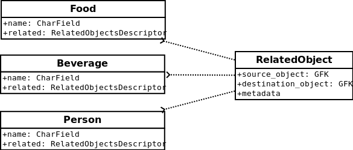

Overview
========

What its all about is connecting models together and, if you want, creating some
metadata about the meaning of that relationship (i.e. a tag).

To this end, django-generic-m2m does three things to make this behavior easier:

1. wraps up all querying and connecting logic in a single attribute that acts on both model instances and the model class
2. allows any model to be used as the intermediary "through" model
3. provides an optimized lookup when ``GenericForeignKeys`` are used

Adding to a model
-----------------

Before you start creating relationships, you'll need to add a ``RelatedObjectsDescriptor``
to any model you plan on relating to other models.

Here's a quick example::

    from django.db import models
    
    from genericm2m.models import RelatedObjectsDescriptor

    
    class Food(models.Model):
        name = models.CharField(max_length=255)

        related = RelatedObjectsDescriptor()

        def __unicode__(self):
            return self.name

    class Beverage(models.Model):
        name = models.CharField(max_length=255)

        related = RelatedObjectsDescriptor()

        def __unicode__(self):
            return self.name

If you'd like to add relationships to a model that you don't control (for example
the ``User`` model from ``django.contrib.auth``), you can use the ``monkey_patch``
utility::

    from django.contrib.auth.models import User
    
    from genericm2m.utils import monkey_patch
    
    monkey_patch(User, name='related')

What is this "related" attribute?
----------------------------------

The "related" attribute from the previous examples is the way the generic many-to-many 
is exposed for each model. Behind-the-scenes it is using ``genericm2m.models.RelatedObject``, 
which looks like this::

    class RelatedObject(models.Model):
        """
        A generic many-to-many implementation where diverse objects are related
        across a single model to other diverse objects -> using a dual GFK
        """
        # SOURCE OBJECT:
        parent_type = models.ForeignKey(ContentType, related_name="child_%(class)s")
        parent_id = models.IntegerField(db_index=True)
        parent = GenericForeignKey(ct_field="parent_type", fk_field="parent_id")

        # ACTUAL RELATED OBJECT:
        object_type = models.ForeignKey(ContentType, related_name="related_%(class)s")
        object_id = models.IntegerField(db_index=True)
        object = GenericForeignKey(ct_field="object_type", fk_field="object_id")

        alias = models.CharField(max_length=255, blank=True)
        creation_date = models.DateTimeField(auto_now_add=True)

        class Meta:
            ordering = ('-creation_date',)

        def __unicode__(self):
            return '%s related to %s ("%s")' % (self.parent, self.object, self.alias)

There's not really too much that should be weird about this model. It contains 
two ``GenericForeignKeys``, one to represent the "from" object, the source of the 
connection, and another to represent to "to" object (what "from" is being connected 
with). Additionally, the model is storing a little bit of metadata about the 
relationship, specifically an "alias" which is just a character string, and a ``creation_date``
to mark when this relationship was created.

Creating and querying relationships
-----------------------------------

A custom model manager is exposed on each model via the ``RelatedObjectsDescriptor``.
The API for creating and querying relationships is exposed via this descriptor.

Here is a sample interactive terminal session::

    >>> pizza = Food.objects.create(name='pizza')
    >>> cereal = Food.objects.create(name='cereal')
    >>> beer = Beverage.objects.create(name='beer')
    >>> soda = Beverage.objects.create(name='soda')
    >>> milk = Beverage.objects.create(name='milk')
    >>> healthy_eater = User.objects.create_user('healthy_eater', 'healthy@health.com', 'secret')
    >>> chocula = User.objects.create_user('chocula', 'chocula@postcereal.com', 'garlic')

Now that we have some Food, Beverage and User objects, create some connections between them::

    >>> rel_obj = pizza.related.connect(beer, alias='Beer and pizza are good')
    >>> type(rel_obj)
    <class 'genericm2m.models.RelatedObject'>

The object that represents the connection is an instance of whatever is passed to 
the ``RelatedObjectDescriptor`` when it is added to a model, but the default 
is ``genericm2m.models.RelatedObject``. Here are the interesting properties of the 
new related object::

    >>> rel_obj.parent
    <Food: pizza>
    >>> rel_obj.object
    <Beverage: beer>
    >>> rel_obj.alias
    'Beer and pizza are good'

These relationships can be queried::

    >>> pizza.related.all()
    [<RelatedObject: pizza related to beer ("Beer and pizza are good")>]

When the `RelatedObject` is a GFK, as is the case here, the ``RelatedObjectsDescriptor`` will 
return a special ``QuerySet`` class that provides an optimized lookup of any GFK-ed objects::

    >>> type(pizza.related.all())
    <class 'genericm2m.models.GFKOptimizedQuerySet'>
    >>> pizza.related.all().generic_objects()
    [<Beverage: beer>]

If the object on the back-side of the relationship also has a ``RelatedObjectsDescriptor`` with 
the same intermediary model, reverse lookups are possible:

    >>> beer.related.related_to()
    [<RelatedObject: pizza related to beer ("Beer and pizza are good")>]

Create some more connections - any combination of models can be used. Below I'm 
connectiong a Food (cereal) to both Beverage objects (milk) and User objects (Chocula)::

    >>> cereal.related.connect(milk)
    <RelatedObject: cereal related to milk ("")>
    >>> cereal.related.connect(chocula)
    <RelatedObject: cereal related to chocula ("")>

    >>> cereal.related.all()
    [<RelatedObject: cereal related to chocula ("")>,
     <RelatedObject: cereal related to milk ("")>]

    >>> chocula.related.all()
    []
    >>> chocula.related.related_to()
    [<RelatedObject: cereal related to chocula ("")>]

Also worth noting is that the ``RelatedObjectsDescriptor`` works on both the 
instance-level and the class-level, so if we wanted to see all objects related to foods::

    >>> Food.related.all()
    [<RelatedObject: cereal related to chocula ("")>,
     <RelatedObject: cereal related to milk ("")>,
     <RelatedObject: pizza related to beer ("Beer and pizza are good")>]

Using a custom "through" model
------------------------------

It's possible to use a custom "through" model in place of the default ``RelatedObject``. 
If you know you're only going to be using a couple models, this can be a handy way 
to save queries. Looking at the tests, here's another silly example where we 
have a ``RelatedBeverage`` model that our Food model will use::

    class RelatedBeverage(models.Model):
        food = models.ForeignKey('Food')
        beverage = models.ForeignKey('Beverage')

        class Meta:
            ordering = ('-id',)

    class Food(models.Model):
        # ... same as above except for this new attribute:
        related_beverages = RelatedObjectsDescriptor(RelatedBeverage, 'food', 'beverage')

The "related_beverages" attribute is an instance of ``RelatedObjectsDescriptor``,
but it is instantiated with a couple of arguments:

* RelatedBeverage: the model to be used to hold the "connections"
* 'food': the field name on the above model which maps to the "from" object
* 'beverage': the field name which maps to the "to" object

Continuing the shell session from above with the same models, foods can be
connected to beverages using the new "related_beverages" attribute::

    >>> pizza.related_beverages.connect(soda)
    <RelatedBeverage: RelatedBeverage object>
    
Querying provides the same interface, but since the "to" object is a direct
``ForeignKey`` to Beverage, a normal django ``QuerySet`` is used::

    >>> pizza.related_beverages.all()
    [<RelatedBeverage: RelatedBeverage object>]
    >>> type(pizza.related_beverages.all())
    <class 'django.db.models.query.QuerySet'>

A ``TypeError`` will be raised if you try to connect an invalid object, such as 
a Person to the "related_beverages"::

    >>> pizza.related_beverages.connect(mario)
    *** TypeError: Unable to query ...

And lastly, just like before, its possible to query on the class to get all the 
``RelatedBeverage`` objects for our foods::

    >>> Food.related_beverages.all()
    [<RelatedBeverage: RelatedBeverage object>]

